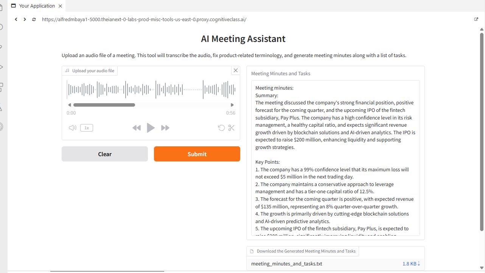

# 🎙️ AI Meeting Assistant | Multimodal GenAI

An end-to-end **Multimodal Generative AI application** that transforms meeting audio into structured meeting minutes and actionable tasks using **OpenAI Whisper, IBM watsonx.ai, IBM Granite, LangChain, and Gradio**.

## 📌 Project Overview

Meetings often contain valuable information that must be manually transcribed, reviewed, summarized, and converted into action items.

This project automates that workflow by combining speech recognition and large language models.

The application allows a user to upload a meeting audio file and automatically:

- Transcribe speech into text using OpenAI Whisper
- Normalize financial terminology using IBM Granite
- Process the transcript using a LangChain prompt workflow
- Generate a concise meeting summary
- Identify key discussion points
- Extract decisions and actionable tasks
- Display the results through an interactive Gradio interface
- Export the generated meeting minutes as a downloadable text file

## 🏗️ Solution Architecture

```text
Meeting Audio
      │
      ▼
OpenAI Whisper
Speech-to-Text
      │
      ▼
Raw Transcript
      │
      ▼
IBM Granite 4 H Small
Financial Terminology Normalization
      │
      ▼
Adjusted Transcript
      │
      ▼
LangChain Prompt Workflow
      │
      ▼
IBM Granite 4 H Small
Meeting Analysis
      │
      ▼
Structured Meeting Minutes
      │
      ├── Summary
      ├── Key Points
      ├── Decisions
      ├── Action Items
      │
      ├──► Gradio Interface
      │
      └──► Downloadable TXT File
```

## 🛠️ Technology Stack

| Technology | Purpose |
|---|---|
| Python | Application development and workflow orchestration |
| OpenAI Whisper | Automatic speech recognition and audio transcription |
| IBM watsonx.ai | AI platform used to access the Granite foundation model |
| IBM Granite 4 H Small | Transcript normalization and meeting analysis |
| LangChain | Prompt orchestration and LLM workflow |
| PromptTemplate / ChatPromptTemplate | Structured instructions for meeting analysis |
| Gradio | Interactive web application |
| PyTorch | Machine learning runtime used by Whisper |
| FFmpeg | Audio processing support |

## 🔄 How It Works

### 1. Audio Upload

The user uploads a meeting recording through the Gradio interface.

### 2. Speech-to-Text

OpenAI Whisper processes the audio and generates a raw transcript.

### 3. Financial Terminology Processing

The transcript is passed to IBM Granite through watsonx.ai.

The model is prompted to recognize and normalize financial terminology and acronyms while preserving the context of the meeting.

Examples include:

```text
VaR → Value at Risk (VaR)
ROA → Return on Assets (ROA)
HSA → Health Savings Account (HSA)
```

### 4. Meeting Analysis

The adjusted transcript is passed through a LangChain prompt workflow and analyzed by IBM Granite.

The model generates:

- Meeting summary
- Key discussion points
- Decisions
- Action items
- Assignees and deadlines when available
- Relevant meeting notes

### 5. Results and Export

The final output is displayed in Gradio and written to a downloadable `meeting_minutes_and_tasks.txt` file.

## 💡 Problem and Solution

Speech-to-text models can produce transcription errors, especially when processing domain-specific terminology.

During testing, the raw Whisper transcription contained:

```text
"maximum loss will mat exceed 5 million"
```

The downstream LLM processing helped produce a contextually corrected statement:

```text
"maximum loss will not exceed $5 million"
```

This demonstrates the value of combining **speech recognition with contextual LLM processing** rather than relying on transcription alone.

## 🖥️ Application Interface

The completed Gradio application provides:

- Audio upload and playback
- Automated transcription
- AI-generated meeting minutes
- Key points and action items
- Downloadable meeting output


## 🧠 What I Learned

This project provided hands-on experience building an end-to-end multimodal GenAI workflow, including:

- Implementing automatic speech recognition with Whisper
- Working with IBM watsonx.ai foundation models
- Using IBM Granite for domain-aware text processing
- Designing prompts for structured LLM output
- Building LangChain processing pipelines
- Connecting multiple AI components into a single workflow
- Developing an interactive AI application with Gradio
- Converting unstructured audio into structured, usable information

## 🚀 Future Enhancements

Potential improvements include:

- Speaker diarization to identify individual meeting participants
- PDF and DOCX meeting-minute exports
- Persistent meeting history
- Support for additional languages
- Improved handling of domain-specific terminology
- Retrieval-Augmented Generation (RAG) for company-specific terminology and policies
- Automated distribution of meeting summaries and action items

## 📁 Project Structure

```text
AI-Meeting-Assistant/
│
├── README.md
├── app.py
├── requirements.txt
│
├── sample/
│   └── meeting_minutes_and_tasks.txt
│
└── screenshots/
        └── ai-meeting-assistant.png
```
### Transcription Challenge

During testing, Whisper produced the following raw transcription:

> "our maximum loss will mat exceed 5 million in the next trading day"

After contextual processing, the final meeting output represented the statement as:

> "The company has a 99% confidence level that its maximum loss will not exceed $5 million in the next trading day."

This demonstrates how an LLM-based post-processing layer can help normalize and contextualize speech-to-text output before generating structured meeting documentation.

## 👤 Author

**Alfred Charles Mbaya**

Data Analytics | Business Intelligence | Generative AI
